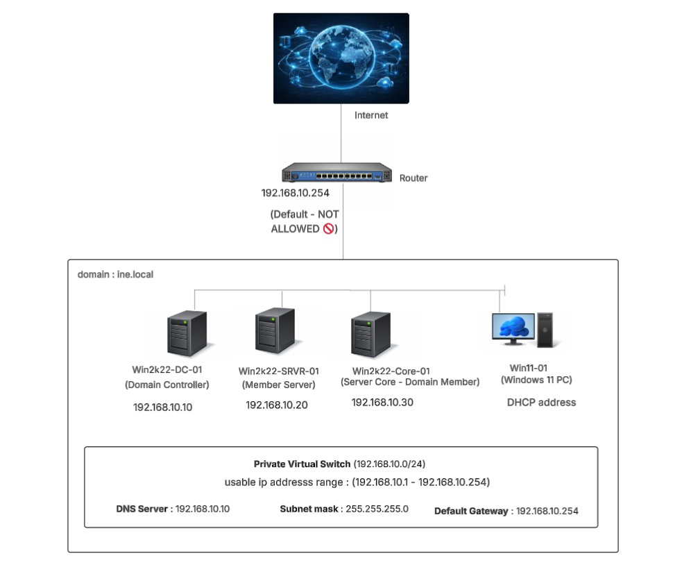
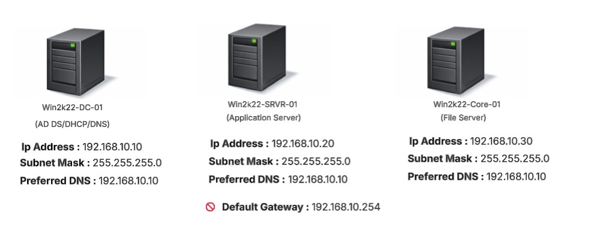
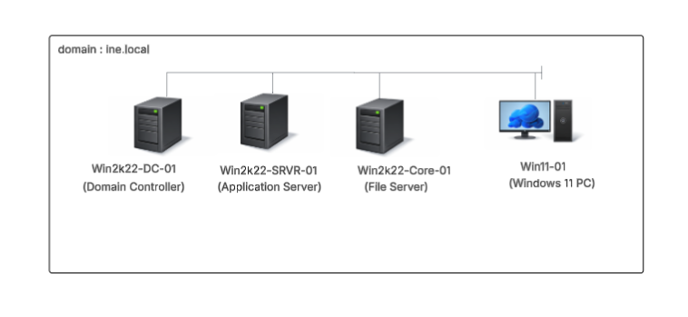

# Enterprise IT Support Labs

This repository contains hands-on labs designed to build practical skills in Windows Server administration, Active Directory, Group Policy, DHCP/DNS, and modern device management (MD-102 / Intune). The labs simulate a small enterprise environment and are suitable for learning, practicing, or showcasing IT support and system administration skills.

---

## Lab Roadmap

- [**Lab 1: Domain Foundation and Active Directory Deployment**](/windows-server-labs/lab-1-setup-environment/docs/README.md)
- [**Lab 2: Configure DHCP and DNS Services for the Domain**](/windows-server-labs/lab-2-dhcp-dns/docs/README.md)  
- [**Lab 3: Active Directory Organisation: OUs, Users, Groups and Delegation**](/windows-server-labs/lab-3-ad-ou-gpo-user-management-basics/docs/README.md) 
- **Lab 4:** Configure File and Print Services with Permissions and Shares  
- **Lab 5:** Troubleshoot Common Active Directory and Windows Server Networking Issues   

## Goals of these labs

- Build hands-on experience with Windows Server environments  
- Understand domain foundations, Active Directory, Group Policy, and network services  
- Practice modern device and endpoint management  

## Lab Diagrams

Visual references to help understand the lab setup and architecture:

**`Network Architecture`**
- Shows the lab network layout, subnets, and connectivity between servers. 

**`3 Servers for this labs`**
- Illustrates each server in the lab and its assigned static IP address. 

**`Logical Diagram`**
- Depicts the Active Directory structure, domain membership, and server roles.

---

Note: Lab diagrams were designed using *Lucidchart*, and server, router, internet, and PC (desktop) images were generated with *ChatGPT* for clarity.
